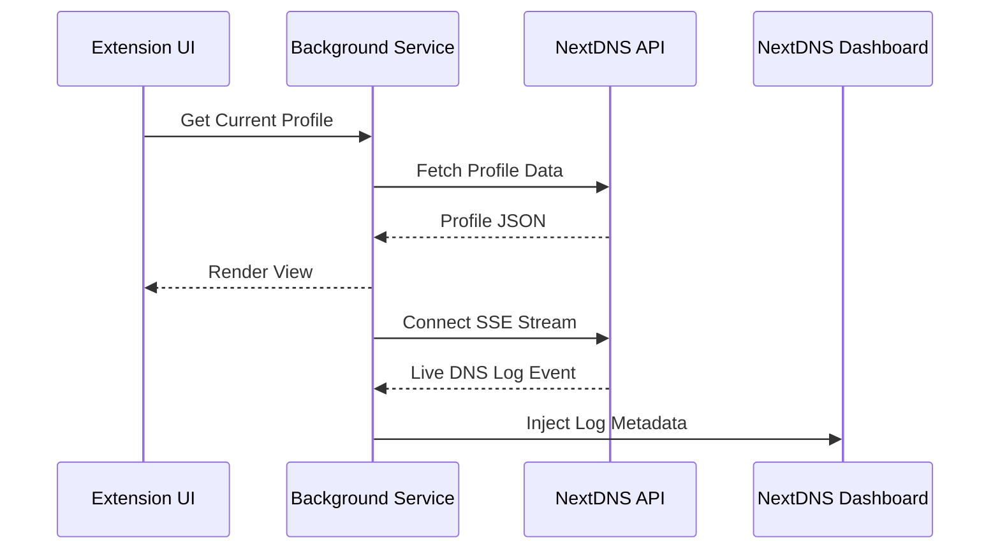

# System Overview

DNS Forge is built on a modular, asynchronous architecture designed to handle high-volume DNS logs and complex dashboard interactions with minimal overhead.

---

## 🏗️ High-Level Architecture

The extension is divided into three primary functional domains:

### 1. Background Engine (`src/background/`)
The "brain" of the extension. It manages:
- **State Management:** Centralized tracking of active profiles, blocked requests, and scheduler alarms.
- **NextDNS API Client:** Resilient communication with exponential backoff.
- **SSE Stream Manager:** Handles the real-time Server-Sent Events connection for live log updates.
- **Request Listeners:** Monitors browser network requests to correlate them with DNS logs.

### 2. UI Components (`src/ui/`)
The presentation layer, consisting of the extension popup and the injected dashboard elements.
- **Modular Views:** Separate logic for Analytics, Debugger, and Management tools.
- **Dashboard Injections:** Surgical DOM manipulations that enhance the native NextDNS interface.

### 3. Content Scripts (`src/content/`)
The bridge between the extension and the NextDNS web dashboard.
- **DOM Observers:** Monitors for changes in the NextDNS UI to trigger automated enhancements.
- **Interaction Layer:** Facilitates communication between the web page and the background engine.

---

## 📡 Data Flow

---

## 🔐 Security Model

We utilize a "Privacy-First" security model:
- **No Remote Tracking:** All analytics and diagnostics are performed locally within your browser.
- **Credential Safety:** API keys are stored in encrypted browser storage and never transmitted to third parties.
- **Hardened Injections:** We use `DOMParser` to sanitize every string before it enters the DOM, effectively neutralizing XSS attack vectors.
